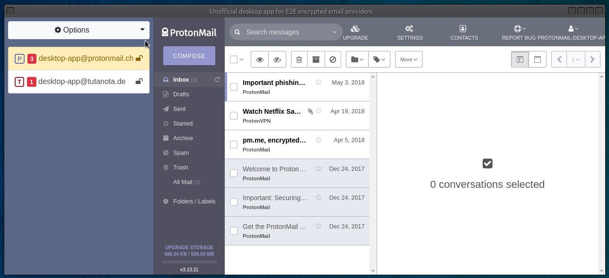

# email-securely-app

is built with Electron unofficial desktop app for [ProtonMail](https://protonmail.com/) and [Tutanota](https://tutanota.com/) E2E encrypted email providers, basically a wrapper around their web interfaces with some enhancements aimed to improve desktop users experience.

 

## Features
- Cross platform, Linux/OSX/Windows installation packages [provided](https://github.com/vladimiry/email-securely-app/releases).
- Multi email providers support.
- Multi accounts support per each email provider. Individual entry point domain selection is [enabled](https://github.com/vladimiry/email-securely-app/issues/29).
- Automatic login into the app with remembered master password using [keytar](https://github.com/atom/node-keytar) module ("Keep me signed in" feature).
- Automatic login into mail provider accounts using either saved in the settings password or KeePass password manager. Two-factor authentication (2FA) is supported, only TOTP tokens format, [original issue](https://github.com/vladimiry/email-securely-app/issues/10).
- Encrypted settings storage with switchable predefined key derivation and encryption presets. Argon2 is used as the default key derivation function.
- Native notifications for individual accounts clicking on which focuses the app window and selects respective account in the accounts list.
- System tray icon with a total number of unread messages shown on top of it. Checking unread emails count for Tutanota is currently not efficient enough, respective [issue](https://github.com/vladimiry/email-securely-app/issues/30) has been placed.
- Full, tabs and dropdown view modes. See details [here](https://github.com/vladimiry/email-securely-app/issues/36) and screenshots in [images](images) folder.
- Start minimized to tray.
- Close to tray.

## Build your own package

- Regardless of the platform you are working on, you will need to have Node.js v10 installed. v10 as it's recommended to go with the same Node.js version Electron comes with. If you already have Node.js installed, but not the version 10, then you might want to use [Node Version Manager](https://github.com/creationix/nvm) to be able to switch between multiple Node.js versions:
  - Install [NVM](https://github.com/creationix/nvm).
  - Run `nvm install 10`.
  - Run `nvm use 10`.
- Some native modules require node prebuilds files compiling and for that Python and C++ compiler need to be installed on your system:
  - **`On Windows`**: the simplest way to install all the needed stuff on Windows is to run `npm install --global --production windows-build-tools` CLI command.
  - **`On Linux`**: `python v2.7`, `make` and a C/C++ compiler toolchain, like `GCC` are most likely already installed. Besides [keytar](https://github.com/atom/node-keytar) needs `libsecret` library to be installed.
  - **`On Mac OS X`**: `python v2.7` and [Xcode](https://developer.apple.com/xcode/download/) need to be installed. You also need to install the `Command Line Tools` via Xcode, can be found under the `Xcode -> Preferences -> Downloads` menu.
- [Clone](https://help.github.com/articles/cloning-a-repository/) this project to your local device. If you are going to contribute, consider cloning the [forked](https://help.github.com/articles/fork-a-repo/) into your own GitHub account project.
- Install dependencies running `yarn`.
- Build app running `yarn run app:dist`. It's better to not touch a mouse during the process, since it might interfere with the `e2e` tests running at the end of the process.
- Build a package to install running `yarn run electron-builder:dist` command to build Windows/Mac OS X package and one of the following commands to build Linux package:
  - `yarn run electron-builder:dist:linux:appimage`
  - `yarn run electron-builder:dist:linux:deb`
  - `yarn run electron-builder:dist:linux:freebsd`
  - `yarn run electron-builder:dist:linux:pacman`
  - `yarn run electron-builder:dist:linux:rpm`
  - `yarn run electron-builder:dist:linux:snap`
- If you don't need a package to install, but a folder to execute app from, simply run `yarn run electron-builder:dir` command.  
- Binary executable, whether it's a folder or package to install, comes into the `./dist` folder.
